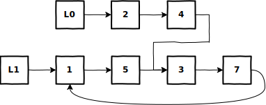

# Test for Overlapping Lists&mdash;Lists May Have Cycles
Given 2 singly linked lists may contain cycles, find the node where the 2 lists intersect.

## Example


```
 Input: L0 = [2, 4, 5, 3, 7]
        L1 = [1, 5, 3, 7]
Output: Both 1 and 5 are acceptable answers
```

## Solution
```python
def has_cycle(head):
    slow = fast = head
    while fast and fast.next:
        fast = fast.next.next
        slow = slow.next
        if fast is slow:
            fast = head
            while fast is not slow:
                fast = fast.next
                slow = slow.next
            return fast
    return None


def overlapping_no_cycle_lists(L0, L1):
    a = L0
    b = L1
    while a is not b:
        a = a.next if a else L1
        b = b.next if b else L0
    return a


def overlapping_lists(L0, L1):
    c0 = has_cycle(L0)
    c1 = has_cycle(L1)
    if not c0 and not c1:
        return overlapping_no_cycle_lists(L0, L1)
    if (c0 and not c1) or (not c0 and c1):
        return None

    tmp = c1
    while True:
        tmp = tmp.next
        if tmp is c0 or tmp is c1:
            break
    if tmp is not c0:
        return None

    while L0 is not L1 and L0 is not c0 and L1 is not c1:
        L0 = L0.next
        L1 = L1.next
    return L0 if L0 is L1 else c0
```

## Explanation
* For explanations on the two helper functions:
    1. [Test for Cyclicity](is_list_cyclic.md)
    2. [Test for Overlapping Lists—Lists Are Cycle-Free](do_terminated_lists_overlap.md)

The solution involves testing for various cases:
1. Neither list contains a cycle
    * Return the result from `overlapping_no_cycle_lists(L0, L1)`
2. Only one list contains a cycle
    * The lists cannot overlap, so return None
3. Both lists contain a cycle
    1. If the cycles are not identical, return None
    2. If the cycles are identical, there are two subcases:
        1. The lists intersect before the start of the cycle
            * Return the start of the cycle
        2. The lists reach the cycle at different nodes on the cycle
            * The first overlapping node is not unique, so return any node on the cycle

## Code Dissection
1. Check the two lists to see if they contain cycles
    ```python
    c0 = has_cycle(L0)
    c1 = has_cycle(L1)
    ```
2. If neither list contains a cycle, use `overlapping_no_cycle_lists(L0, L1)`
    ```python
    if not c0 and not c1:
        return overlapping_no_cycle_lists(L0, L1)
    ```
3. If only one list contains a cycle, they cannot overlap
    ```python
    if (c0 and not c1) or (not c0 and c1):
        return None
    ```
4. If both lists contain a cycle, check if the cycles are identical
    ```python
    tmp = c1
    while True:
        tmp = tmp.next
        if tmp is c0 or tmp is c1:
            if tmp is not c0:
                return None
            break
    ```
5. If the cycles are identical, check where the lists intersect
    ```python
    while (L0 is not L1) and (L0 is not c0) and (L1 is not c1):
        L0 = L0.next
        L1 = L1.next
    ```
6. If the lists intersect before the cycle, return the start of the cycle, else, return any node on the cycle
    ```python
    return L0 if L0 is L1 else c0
    ```