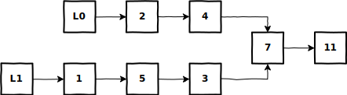

# Test for Overlapping Lists&mdash;Lists Are Cycle-Free
Write a program that takes two cycle-free singly linked lists, and determines if there exists a node that is common to both lists.
  
## Example


```
 Input: L0 = [2, 4, 7, 11]
        L1 = [1, 5, 3, 7, 11]
Output: 7
```
  
## Solution
```python
def overlapping_no_cycle_lists(l0, l1):
    a = l0
    b = l1
    while a is not b:
        a = a.next if a else l1
        b = b.next if b else l0
    return a
```
  
## Explanation
* We use two pointers, _a_ and _b_, to traverse through _l0_ and _l1_ in such a manner that the two pointers will meet at the intersection node
* _a_ starts at the head of _l0_ and traverses the list one node at a time until the end of the list, then it is redirected to the head of _l1_
* _b_ starts at the head of _l1_ and traverses the list one node at a time until the end of the list, then it is redirected to the head of _l0_
* _a_ and _b_ will meet each other by the second pass, meaning _a_ and _b_ will both traverse _l0_ and _l1_ once
* The idea behind switching where _a_ and _b_ point at when reaching the end of a list is to counter any difference in length
  
## Code Dissection
1. Initialize two pointers at the head of _l0_ and _l1_ respectively
    ```python
    a = l0
    b = l1
    ```
2. Loop through each list until the two pointers meet
    ```python
    while a is not b:
        a = a.next if a else l1
        b = b.next if b else l0
    ```
    * _a_ moves across _l0_ one node at a time until the end of _l0_, then it is switched to _l1_
    * _b_ moves across _l1_ one node at a time until the end of _l1_, then it is switched to _l0_
    * _a_ and _b_ will meet at the intersection node within 2 passes
3. Return the node at which the two pointers meet
    ```python
    return a
    ```
    * If the two lists intersect, the intersection node will be returned
    * If the two lists do not intersect:
        1. Assuming each list is the same length, _a_ will reach the end of _l0_ at the same time _b_ reaches the end of _l1_, and ```None``` will be returned
        2. Assuming one list is longer than the other, on the second pass, _a_ will reach the end of _l1_ at the same time _b_ reaches the end of _l0_, and ```None``` will be returned