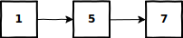

# Test for Cyclicity
Although a linked list is supposed to be a sequence of nodes ending in null, it is possible to create a cycle in a linked list by making the next field of an element reference to one of the earlier nodes.  
  
Write a program that takes the head of a singly linked list and returns null if there does not exist a cycle, and the node at the start of the cycle, if a cycle is present. (You do not know the length of the list in advance.)
  
## Examples


```
 Input: [1, 5, 7]
Output: None
```


```
 Input: [1, 2, 3, 4]
Output: 2
```
  
## Solution
```python
def has_cycle(head):
    slow = fast = head
    while fast and fast.next:
        fast = fast.next.next
        slow = slow.next
        if fast is slow:
            fast = head
            while fast is not slow:
                fast = fast.next
                slow = slow.next
            return fast
    return None
```
  
## Explanation
* The solution uses [Floyd's cycle-finding algorithm](https://en.wikipedia.org/wiki/Cycle_detection#Floyd's_Tortoise_and_Hare)
* Imagine a slow and fast runner racing around a circular track -- the fast runner will eventually meet the slow runner
* For checking if the list is cyclic, we use two pointers and if they meet, the list contains a cycle
    1. The _slow_ pointer moves 1 step at a time
    2. The _fast_ pointer moves 2 steps at a time
* If there is a cycle, after the two pointers meet, the start of the cycle can be found by setting a pointer at the head and iterating both slow pointers at the same time until they meet 
* If there is not a cycle in the list, the fast pointer will eventually reach the end of the list
  
## Code Dissection
1. Initialize a _slow_ and _fast_ pointer to the head of the list
    ```python
    slow = fast = head
    ```
2. Iterate both pointers through the list until the _fast_ pointer reaches the end of the list
    ```python
    while fast and fast.next:
        fast = fast.next.next
        slow = slow.next
    ```
    * The _fast_ pointer moves 2 steps at a time
    * The _slow_ pointer moves 1 step at a time
    * The _fast_ pointer will reach the end of the list if there is no cycle
3. If the two pointers meet and the list is cyclic, find the start of the cycle and return it
    ```python
    if fast is slow:
        fast = head
        while fast is not slow:
            fast = fast.next
            slow = slow.next
        return fast
    ```
    * When finding the start of the cycle, the _fast_ and _slow_ pointer both move 1 step at a time
    * The start of the cycle is found when the two pointers meet
    * The ```is``` operator compares if two objects are the same, not if they contain the same value
4. If the list is not cyclic, return None
    ```python
    return None
    ```