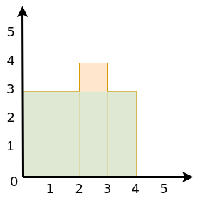

# Compute the Largest Rectangle Under the Skyline
BLANK

## Example


```
 Input: [3, 3, 4, 3, 2]
Output: 12
```

## Solution
```python
BLANK
```

## Explanation
* BLANK

## Code Dissection
1. BLANK