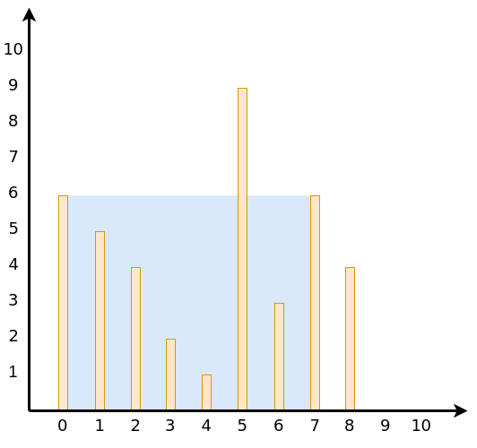

# Compute the Maximum Water Trapped by a Pair of Vertical Lines
Given an array of integers that represent vertical lines on a graph, find the maximum amount of water that can be trapped between 2 lines. Each number in the array represents the height of the line (_y_-axis), and its index is the position of the line (_x_-axis).

## Examples


```
 Input: [6, 5, 4, 2, 1, 9, 3, 6, 4]
Output: 42

The water is trapped between the vertical lines at x = 0 and x = 7.
Since the 2 lines are 7 spaces apart and both are 6 in height,
the water trapped = 7 * 6 = 42.
```

## Solution
```python
def get_max_trapped_water(heights):
    left = 0
    right = len(heights) - 1
    max_water = 0
    while left < right:
        width = right - left
        max_water = max(max_water, min(heights[left], heights[right]) * width)
        if heights[left] < heights[right]:
            left += 1
        else:
            right -= 1
    return max_water
```

## Explanation
* Use 2 pointers _left_ and _right_ to iterate through pairs of vertical lines
* The water trapped between 2 vertical lines = min(line1, line2) * (_right_ - _left_)

## Code Dissection
1. Initialize 2 pointers at the start and end of _heights_ respectively and the max water trapped
    ```python
    left = 0
    right = len(heights) - 1
    max_water = 0
    ```
2. Iterate through pairs of vertical lines until the 2 pointers meet
    ```python
    while left < right:
    ```
3. Calculate the width between 2 lines (distance on _x_-axis)
    ```python
    width = right - left
    ```
4. Compare the water that can be trapped by the current pair of lines and update *max_water* accordingly
    ```python
    max_water = max(max_water, min(heights[left], heights[right]) * width)
    ```
5. If _left_ line-height < _right_ line-height, increment _left_ pointer, otherwise, decrement _right_ pointer
    ```python
    if heights[left] < heights[right]:
        left += 1
    else:
        right -= 1
    ```
6. Return the max water that can be trapped by 2 of the vertical lines
    ```python
    return max_water
    ```